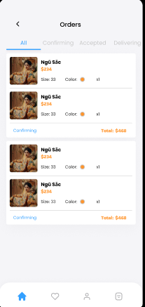

# XÂY DỰNG ỨNG DỤNG THƯƠNG MẠI VỀ THỜI TRANG

Nhận thấy tầm quan trọng và ý nghĩa văn hóa của cổ phục Việt Nam, nhóm chúng em quyết định xây dựng một Ứng dụng Shop bán cổ phục Việt Nam. Ứng dụng không chỉ hướng đến việc cung cấp trải nghiệm mua sắm đơn giản, tiết kiệm thời gian cho người tiêu dùng mà còn giúp các cửa hàng kinh doanh cổ phục dễ dàng quản lý, lưu trữ thông tin và phát triển bền vững. Hơn nữa, ứng dụng còn góp phần lan tỏa và bảo tồn giá trị truyền thống thông qua việc đưa các sản phẩm cổ phục đến gần hơn với đông đảo người tiêu dùng hiện đại một cách tiện lợi trên thiết bị di động.

## Nhóm phát triển

- **Ngô Nguyên Bảo** - 21119170
- **Lê Minh Quang** - 21110270

## Figma Design

Dưới đây là các màn hình chính của ứng dụng được thiết kế trên Figma:

### Màn hình đăng nhập và đăng ký

### Màn hình chính và danh sách sản phẩm

---

### Màn hình giỏ hàng

## 

### Màn hình thông tin sản phẩm

---

### Thanh điều hướng

## 

### Hồ sơ cá nhân

---

### Danh sách yêu thích

---

### Danh sách hóa đơn

---

### Danh sách địa chỉ

---

### Các màn hình khác

Các màn hình này thể hiện giao diện người dùng chính của ứng dụng, bao gồm các chức năng đăng nhập, đăng ký, xem bài tập, thảo luận, quản lý hồ sơ và xem thống kê. Thiết kế tập trung vào tính đơn giản, dễ sử dụng và hiệu quả cho người dùng trên thiết bị di động.

---
